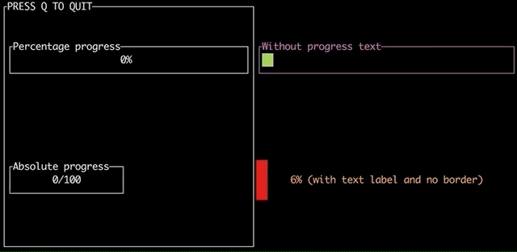
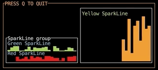
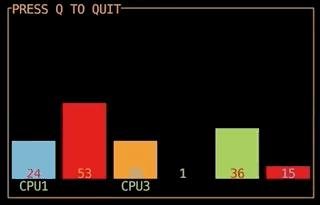
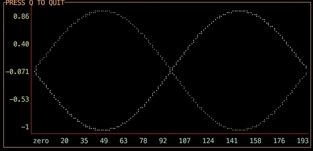

# termdash

This project implements a terminal based dashboard. The feature set is inspired
by the [gizak/termui](http://github.com/gizak/termui) project, which in turn
was inspired by a javascript based
[yaronn/blessed-contrib](http://github.com/yaronn/blessed-contrib). Why the
rewrite you ask?

1. The above mentioned [gizak/termui](http://github.com/gizak/termui) is
   abandoned and isn't maintained anymore.
1. The project doesn't follow the design goals outlined below.

# Design goals

This effort is focused on good software design and maintainability. By good
design I mean:

1. Write readable, well documented code.
1. Only beautiful, simple APIs, no exposed concurrency, channels, internals, etc.
1. Follow [Effective Go](http://golang.org/doc/effective_go.html).
1. Provide an infrastructure that allows development of individual dashboard
   components in separation.
1. The infrastructure must enforce consistency in how the dashboard components
   are implemented.
1. Focus on maintainability, the infrastructure and dashboard components must
   have good test coverage, the repository must have CI/CD enabled.

On top of that - let's have fun, learn something and become better developers
together.

# Requirements

1. Native support of the UTF-8 encoding.
1. Simple container management to position the widgets and set their size.
1. Mouse and keyboard input.
1. Cross-platform terminal based output.
1. Unit testing framework for simple and readable tests of dashboard elements.
1. Tooling to streamline addition of new widgets.
1. Apache-2.0 licence for the project.

# High-Level design

See the [design document](doc/hld.md).

# Contributing

If you are willing to contribute, improve the infrastructure or develop a
widget, first of all Thank You! Your help is appreciated.

Please see the [CONTRIBUTING.md](CONTRIBUTING.md) file for guidelines related
to the Google's CLA, and code review requirements.

As stated above the primary goal of this project is to develop readable, well
designed code, the functionality and efficiency come second. This is achieved
through detailed code reviews, design discussions and following of the [design
guidelines](doc/design_guidelines.md). Please familiarize yourself with these
before contributing.

## Contributing widgets

If you're developing a new widget, please see the [widget
development](doc/widget_development.md) section.

## Implemented Widgets

### The Gauge

Displays the progress of an operation. Run the
[gaugedemo](widgets/gauge/demo/gaugedemo.go).

### The Text

Displays text content, supports trimming and scrolling of content. Run the
[textdemo](widgets/text/demo/textdemo.go).

### The SparkLine

Draws a graph showing a series of values as vertical bars. The bars can have
sub-cell height. Run the
[sparklinedemo](widgets/sparkline/sparklinedemo/sparklinedemo.go).

### The BarChart

Displays multiple bars showing relative ratios of values. Run the
[barchartdemo](widgets/barchart/barchartdemo/barchartdemo.go).

### The LineChart

Displays series of values as line charts. Run the
[linechartdemo](widgets/linechart/linechartdemo/linechartdemo.go).

## Disclaimer

This is not an official Google product.
