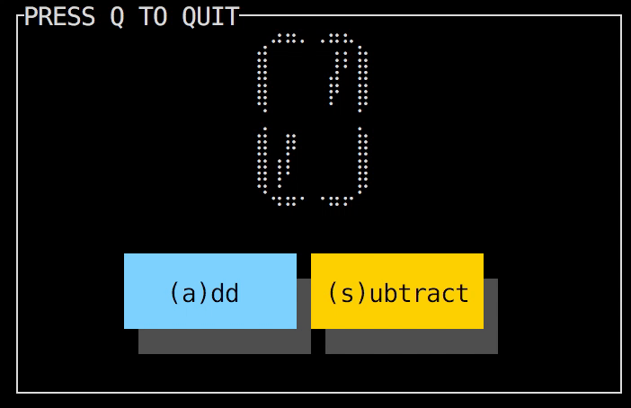
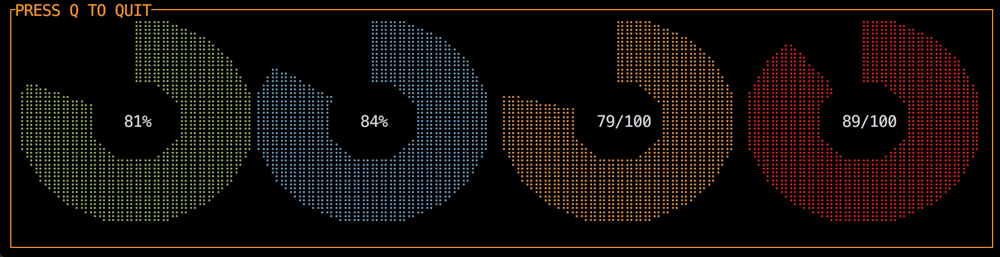
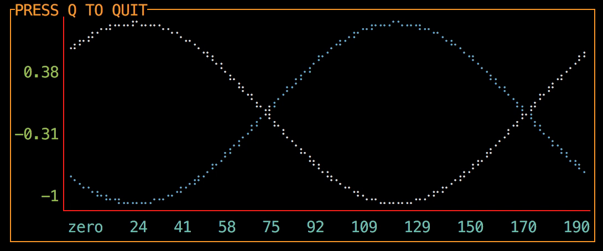

[](https://godoc.org/github.com/mum4k/termdash)
[](https://travis-ci.org/mum4k/termdash)
[](https://sourcegraph.com/github.com/mum4k/termdash?badge)
[](https://coveralls.io/github/mum4k/termdash?branch=master)
[](https://goreportcard.com/report/github.com/mum4k/termdash)
[](https://github.com/mum4k/termdash/blob/master/LICENSE)
[](https://github.com/avelino/awesome-go)

# termdash

[](termdashdemo/termdashdemo.go)

Termdash is a cross-platform customizable terminal based dashboard.
The feature set is inspired by the
[gizak/termui](http://github.com/gizak/termui) project, which in turn was
inspired by
[yaronn/blessed-contrib](http://github.com/yaronn/blessed-contrib).

This rewrite focuses on code readability, maintainability and testability, see
the [design goals](doc/design_goals.md). It aims to achieve the following
[requirements](doc/requirements.md). See the [high-level design](doc/hld.md)
for more details.

# Public API and status

The public API surface is documented in the
[wiki](http://github.com/mum4k/termdash/wiki).

Private packages can be identified by the presence of the **/internal/**
directory in their import path. Stability of the private packages isn't
guaranteed and changes won't be backward compatible.

There might still be breaking changes to the public API, at least until the
project reaches version 1.0.0. Any breaking changes will be published in the
[changelog](CHANGELOG.md).

# Current feature set

- Full support for terminal window resizing throughout the infrastructure.
- Customizable layout, widget placement, borders, colors, etc.
- Focusable containers and widgets.
- Processing of keyboard and mouse events.
- Periodic and event driven screen redraw.
- A library of widgets, see below.
- UTF-8 for all text elements.
- Drawing primitives (Go functions) for widget development with character and
  sub-character resolution.

# Installation

To install this library, run the following:

```
go get -u github.com/mum4k/termdash
```

# Usage

The usage of most of these elements is demonstrated in
[termdashdemo.go](termdashdemo/termdashdemo.go). To execute the demo:


```
go run github.com/mum4k/termdash/termdashdemo/termdashdemo.go
```

# Documentation

Please refer to the [Termdash wiki](http://github.com/mum4k/termdash/wiki) for
all documentation and resources.

# Implemented Widgets

## The Button

Allows users to interact with the application, each button press runs a callback function.
Run the
[buttondemo](widgets/button/buttondemo/buttondemo.go).

```go
go run github.com/mum4k/termdash/widgets/button/buttondemo/buttondemo.go
```

[](widgets/button/buttondemo/buttondemo.go)

## The Gauge

Displays the progress of an operation. Run the
[gaugedemo](widgets/gauge/gaugedemo/gaugedemo.go).

```go
go run github.com/mum4k/termdash/widgets/gauge/gaugedemo/gaugedemo.go
```

[](widgets/gauge/gaugedemo/gaugedemo.go)

## The Donut

Visualizes progress of an operation as a partial or a complete donut. Run the
[donutdemo](widgets/donut/donutdemo/donutdemo.go).

```go
go run github.com/mum4k/termdash/widgets/donut/donutdemo/donutdemo.go
```

[](widgets/donut/donutdemo/donutdemo.go)

## The Text

Displays text content, supports trimming and scrolling of content. Run the
[textdemo](widgets/text/textdemo/textdemo.go).

```go
go run github.com/mum4k/termdash/widgets/text/textdemo/textdemo.go
```

[](widgets/text/textdemo/textdemo.go)

## The SparkLine

Draws a graph showing a series of values as vertical bars. The bars can have
sub-cell height. Run the
[sparklinedemo](widgets/sparkline/sparklinedemo/sparklinedemo.go).

```go
go run github.com/mum4k/termdash/widgets/sparkline/sparklinedemo/sparklinedemo.go
```

[](widgets/sparkline/sparklinedemo/sparklinedemo.go)

## The BarChart

Displays multiple bars showing relative ratios of values. Run the
[barchartdemo](widgets/barchart/barchartdemo/barchartdemo.go).

```go
go run github.com/mum4k/termdash/widgets/barchart/barchartdemo/barchartdemo.go
```

[](widgets/barchart/barchartdemo/barchartdemo.go)

## The LineChart

Displays series of values on a line chart, supports zoom triggered by mouse
events. Run the
[linechartdemo](widgets/linechart/linechartdemo/linechartdemo.go).

```go
go run github.com/mum4k/termdash/widgets/linechart/linechartdemo/linechartdemo.go
```

[](widgets/linechart/linechartdemo/linechartdemo.go)

## The SegmentDisplay

Displays text by simulating a 16-segment display. Run the
[segmentdisplaydemo](widgets/segmentdisplay/segmentdisplaydemo/segmentdisplaydemo.go).

```go
go run github.com/mum4k/termdash/widgets/segmentdisplay/segmentdisplaydemo/segmentdisplaydemo.go
```

[](widgets/segmentdisplay/segmentdisplaydemo/segmentdisplaydemo.go)

# Contributing

If you are willing to contribute, improve the infrastructure or develop a
widget, first of all Thank You! Your help is appreciated.

Please see the [CONTRIBUTING.md](CONTRIBUTING.md) file for guidelines related
to the Google's CLA, and code review requirements.

As stated above the primary goal of this project is to develop readable, well
designed code, the functionality and efficiency come second. This is achieved
through detailed code reviews, design discussions and following of the [design
guidelines](doc/design_guidelines.md). Please familiarize yourself with these
before contributing.

If you're developing a new widget, please see the [widget
development](doc/widget_development.md) section.


# Disclaimer

This is not an official Google product.
