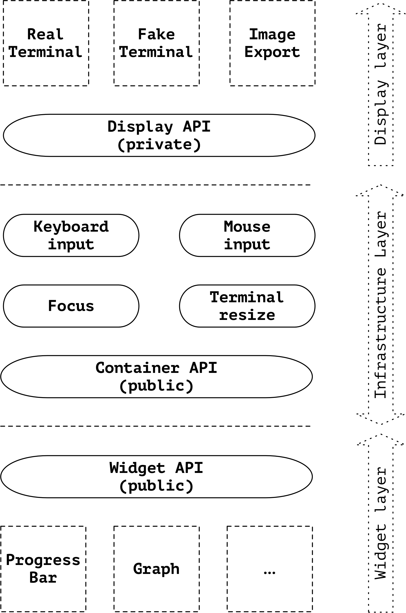

# Terminal Dashboard High-Level Design

## Objective

Develop infrastructure of dashboard widgets. The widgets should support both
input (mouse and keyboard) and output (display of information to the user).

Fulfill the requirements outlined in the main
[README](http://github.com/mum4k/termdash).

## Background

The terminal dashboard allows placement of configurable widgets onto the terminal.

A widget displays some information to the user, e.g. A graph, a chart, a
progress bar. A widget can receive information from the user in the form of
events, e.g. Mouse or keyboard input.

The widgets aren't placed onto the terminal directly, instead the terminal is
organized into containers. Each container can contain either a widget or
other containers.

## Overview

The terminal dashboard consists of the following layers:

- Terminal.
- Infrastructure.
- Widgets.

The **terminal layer** abstracts the terminal implementation. A real terminal
implementation is used in production when displaying data to the user. A fake
terminal implementation is used in widget unit tests and system tests. Other
implementations are possible, e.g. Image export. The terminal layer is private,
neither the users of this library nor the widgets interact with the terminal
directly.

The **infrastructure layer** is responsible for container management, tracking
of keyboard and mouse focus and handling external events like resizing of the
terminal. The infrastructure layer also decides when to flush the buffer and
refresh the screen. I.e. The widgets update content of a back buffer and the
infrastructure decides when it is synchronized to the terminal.

The **widgets layer** contains the implementations of individual widgets. Each
widget receives a canvas from the container on which it presents its content to
the user. Widgets indicate to the infrastructure layer if they support input
events, which are then forwarded from the infrastructure layer.

The user interacts with the widget API when constructing individual widgets and
with the container API when placing the widgets onto the dashboard.

<p align="center">
  
</p>

## Detailed design

### Terminal

The terminal provides access to the input and output.

It allows to:

- Set values and attributes of cells on a back buffer representing a 2-D
  canvas.
- Flush the content of the back buffer to the output.
- Manipulate the cursor position and visibility.
- Read input events (keyboard, mouse, terminal resize, etc...).

The terminal buffers input events until they are read by the client. The buffer
is bound, if the client isn't picking up events fast enough, new events are
dropped and a message is logged.

### Infrastructure

The infrastructure handles terminal setup, input events and manages containers.

#### Keyboard and mouse input

The raw keyboard and mouse events received from the terminal are pre-processed
by the infrastructure. The pre-processing involves recognizing keyboard
shortcuts (i.e. Key combination). The infrastructure recognizes globally
configurable keyboard shortcuts that are processed by the infrastructure. All
other keyboard and mouse events are forwarded to the currently focused widget.

#### Input focus

The infrastructure tracks focus. Only the focused widget receives keyboard and
mouse events. Focus can be changed using mouse or global keyboard shortcuts.
The focused widget is highlighted on the dashboard.

#### Containers

The container provides a way of splitting the dashboard down to smaller
elements where individual widgets can be placed. Each container can be split to
multiple sub containers. A container contains either a sub container or a
widget.

Container is responsible for coordinate translation. Each widget receives a
virtual canvas it can draw on. Each of these canvases starts at coordinates
image.Point{0, 0}. The parent container translates coordinates from the virtual
canvas to the real terminal. The container therefore enforces limits for widgets.

Containers can be styled with borders and other options.

#### Flushing the terminal

All widgets indirectly write to the back buffer of the terminal implementation. The changes
to the back buffer only become visible when the infrastructure flushes its content.

Widgets cannot force a flush, but they can indicate that a flush is desired.
The infrastructure throttles the amount of times this happens.

#### Terminal resizing

The terminal resize events are processed by the infrastructure. Each widget
indicates its desired and minimum size for its canvas when registering with its
parent container.

The parent container in turn informs the widget what is the actual size of its
canvas. The infrastructure guarantees that the actual size won't ever be
smaller than the advertised minimum and guarantees that the size will keep the
aspect ration requested by the widget.

When the size of terminal changes, the infrastructure resizes all containers
according to the rules outlined above, asks all widgets to redraw their
canvases and flushes to the back buffer to the terminal.

### Widgets

Users of the terminal dashboard construct the widgets directly. Therefore each
widget can define its own options and API for setting values (e.g. The
displayed percentage on a progress bar). The users then create the desired
container splits and place each widget into a dedicated container.

Each widget receives a canvas from the parent container, the widget can draw
anything on the canvas as long as it stays within the limits. Helper libraries
are developed that allow placement and drawing of common elements like lines or
geometrical shapes.

## APIs

### Terminal API

The Terminal API is an interface private to the terminal dashboard library. Its
primary purpose is to act as a shim layer over different terminal
implementations.

The following outlines the terminal API:

```go
// Terminal abstracts an implementation of a 2-D terminal.
// A terminal consists of a number of cells.
type Terminal interface {
  // Size returns the terminal width and height in cells.
  Size() image.Point

  // Clear clears the content of the internal back buffer, resetting all cells
  // to their default content and attributes.
  Clear() error
  // Flush flushes the internal back buffer to the terminal.
  Flush() error

  // SetCursor sets the position of the cursor.
  SetCursor(p image.Point)
  // HideCursos hides the cursor.
  HideCursor()

  // SetCell sets the value of the specified cell to the provided rune.
  // Use the options to specify which attributes to modify, if an attribute
  // option isn't specified, the attribute retains its previous value.
  SetCell(p image.Point, r rune, opts ...CellOption)

  // Event waits for the next event and returns it.
  // This call blocks until the next event or cancellation of the context.
  Event(ctx context.Context) Event
}
```

The **Event()** method returns the next input event. Different input event
types are defined as follows.

```go
// Event represents an input event.
type Event interface {
  isEvent()
}

// Keyboard is the event used when a key is pressed.
// Implements Event.
type Keyboard struct {
  // Key identifies the pressed key.
  Key rune
}

func (*Keyboard) isEvent() {}

// Resize is the event used when the terminal was resized.
// Implements Event.
type Resize struct {
  // Size is the new size of the terminal.
  Size image.Point
}

func (*Resize) isEvent() {}

// Mouse is the event used when the mouse is moved or a mouse button is
// pressed.
// Implements Event.
type Mouse struct {
  // Position of the mouse on the terminal.
  Position() image.Point
  // Button identifies the pressed button if any.
  Button MouseButton
}

func (*Mouse) isEvent() {}
```

### Container API

The container API is used to split the terminal and place the widgets. Each
container can be split to two sub containers or have a widget placed into it.
A container can be split either horizontally or vertically.

The containers further accept styling options and alignment options. The
following indicates how the container API will be used.

```go
func main() {
  w := mywidget.New(widgetOptions)
  t := terminal.New(terminalOptions)
  
  t.VerticalSplit()
    .Left(AlignCenter(), WithWidget(w))
    .Right(SolidBorder())
}
```

### Widget API

Each widget must implement the following API. All widget implementations must
be thread-safe since the calls that update the displayed values come in
concurrently with requests and events from the infrastructure.

```go
// Canvas is where a widget draws its output for display on the terminal.
type Canvas struct {}

// Size returns the size of the 2-D canvas given to the widget.
func (c *Canvas) Size() image.Point {}

// Clear clears all the content on the canvas.
func (c *Canvas) Clear() {}

// FlushDesired provides a hint to the infrastructure that the canvas was
// changed and should be flushed to the terminal.
func (c *Canvas) FlushDesired() {}

// SetCell sets the value of the specified cell on the canvas.
// Use the options to specify which attributes to modify, if an attribute
// option isn't specified, the attribute retains its previous value.
func (c *Canvas) SetCell(p image.Point, r rune, opts ...CellOption) {}

// Widget is a single widget on the dashboard.
type Widget interface {
  // Draw executes the widget, when called the widget should draw on the
  // canvas. The widget can assume that the canvas content wasn't modified
  // since the last call, i.e. if the widget doesn't need to change anything in
  // the output, this can be a no-op.
  Draw(canvas *Canvas) error

  // Redraw is called when the widget must redraw all of its content because
  // the previous canvas was invalidated. The widget must not assume that
  // anything on the canvas remained the same, including its size.
  Redraw(canvas *Canvas) error

  // Keyboard is called when the widget is focused on the dashboard and a key
  // shortcut the widget registered for was pressed. Only called if the widget
  // registered for keyboard events.
  Keyboard(s Shortcut) error

  // Mouse is called when the widget is focused on the dashboard and a mouse
  // event happens on its canvas. Only called if the widget registered for mouse
  // events.
  Mouse(m *Mouse) error

  // Options returns registration options for the widget.
  // This is how the widget indicates to the infrastructure whether it is
  // interested in keyboard or mouse shortcuts, what is its minimum canvas
  // size, etc.
  Options() *WidgetOptions
}
```

## Testing plan

Unit test helpers are provided with the terminal dashboard library, these include:

- A fake implementation of the terminal API.
- Unit test comparison helpers to verify the content of the fake terminal.
- Visualization tools to display differences between the expected and the actual.

## Document history

Date        | Author | Description
------------|--------|---------------
24-Mar-2018 | mum4k  | Initial draft.
