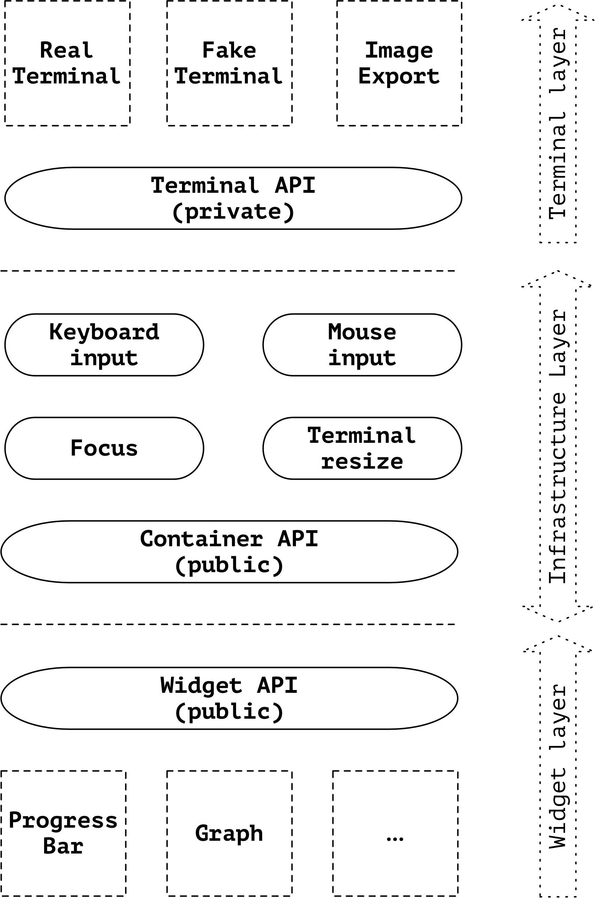

# Terminal Dashboard High-Level Design

## Objective

Develop infrastructure of dashboard widgets. The widgets should support both
input (mouse and keyboard) and output (display of information to the user).

Fulfil the requirements outlined in the main
[README](http://github.com/mum4k/termdash).

## Background

The terminal dashboard allows placement of configurable widgets onto the terminal.

A widget displays some information to the user, e.g. A graph, a chart, a
progress bar. A widget can receive information from the user in the form of
events, e.g. Mouse or keyboard input.

The widgets aren't placed onto the terminal directly, instead the terminal is
organized into containers. Each container can contain either a widget or
other containers.

## Overview

The terminal dashboard consists of the following layers:

- Terminal.
- Infrastructure.
- Widgets.

The **terminal layer** abstracts the terminal implementation. A real terminal
implementation is used in production when displaying data to the user. A fake
terminal implementation is used in widget unit tests and system tests. Other
implementations are possible, e.g. Image export. The terminal layer is private,
neither the users of this library nor the widgets interact with the terminal
directly.

The **infrastructure layer** is responsible for container management, tracking
of keyboard and mouse focus and distribution and handling of external events
like resizing of the terminal. The infrastructure layer also decides when to
flush the buffer and refresh the screen. I.e. The widgets update content of a
back buffer and the infrastructure decides when it is synchronized to the
terminal.

The **widgets layer** contains the implementations of individual widgets. Each
widget receives a canvas from the container on which it presents its content to
the user. Widgets indicate to the infrastructure layer if they support input
events, which are then forwarded from the infrastructure layer.

The user interacts with the widget API when constructing individual widgets and
with the container API when placing the widgets onto the dashboard.

  

## Detailed design

### Terminal

The terminal provides access to the input and output.

It allows to:

- Set values and attributes of cells on a back buffer representing a 2-D
  canvas.
- Flush the content of the back buffer to the output.
- Manipulate the cursor position and visibility.
- Allow the infrastructure to read input events (keyboard, mouse, terminal
  resize, etc...).

### Infrastructure

The infrastructure handles terminal setup, input events and manages containers.

#### Input events

The infrastructure regularly polls events from the terminal layer and feeds
them into the event distribution system (EDS). The EDS fulfils the following
functions:

- Allow subscribers to specify the type of events they want to receive.
- Distributes events in a non-blocking manner, i.e. a single slow subscriber
  cannot slow down other subscribers.
- Events to each subscriber are throttled, if a subscriber builds a long tail
  of unprocessed input events, the EDS selectively drops repetitive events
  towards the subscriber and eventually implements a tail-drop strategy.

The infrastructure itself is an input event subscriber and processes resize and
error events. The infrastructure panics on error events by default, unless an
error handler is provided by the user. Each widget that registers for keyboard
or mouse events is also an event subscriber. Any errors that happen while
processing an input event are send back to the EDS in the form of an Error
event and are processed by the infrastructure.

#### Input keyboard focus

The infrastructure tracks focus. Only the focused widget receives keyboard
events. Focus can be changed using mouse or keyboard shortcuts. The focused
widget is highlighted on the dashboard.

#### Containers

The container provides a way of splitting the dashboard down to smaller
elements where individual widgets can be placed. Each container can be split to
multiple sub containers. A container contains either a sub container or a
widget.

Container is responsible for coordinate translation. Each widget receives a
virtual canvas it can draw on. Each of these canvases starts at coordinates
image.Point{0, 0}. The parent container translates coordinates from the virtual
canvas to the real terminal. The container therefore enforces limits for widgets.

Containers can be styled with borders and other options.

#### Flushing the terminal

All widgets indirectly write to the back buffer of the terminal implementation.
The changes to the back buffer only become visible when the infrastructure
flushes its content.

#### Terminal resizing

The terminal resize events are processed by the infrastructure. Each widget
indicates its desired and minimum size for its canvas when registering with its
parent container.

The parent container in turn informs the widget what is the actual size of its
canvas. The infrastructure guarantees that the actual size won't ever be
smaller than the advertised minimum and guarantees that the size will keep the
aspect ration requested by the widget.

When the size of terminal changes, the infrastructure resizes all containers
according to the rules outlined above, asks all widgets to redraw their
canvases and flushes to the back buffer to the terminal.

### Widgets

Users of the terminal dashboard construct the widgets directly. Therefore each
widget can define its own options and API for setting values (e.g. The
displayed percentage on a progress bar). The users then create the desired
container splits and place each widget into a dedicated container.

Each widget receives a canvas from the parent container, the widget can draw
anything on the canvas as long as it stays within the limits. Helper libraries
are developed that allow placement and drawing of common elements like lines or
geometric shapes.

## APIs

### Terminal API

The Terminal API is an interface private to the terminal dashboard library. Its
primary purpose is to act as a shim layer over different terminal
implementations.

The Terminal API is defined in the
[terminalapi](http://github.com/mum4k/termdash/terminalapi/terminalapi.go)
package.

The **Event()** method returns the next input event. Different input event
types are defined in the
[event.go](http://github.com/mum4k/termdash/terminalapi/event.go)
file.

### Container API

The Container API is used to split the terminal and place the widgets. Each
container can be split to two sub containers or have a widget placed into it.
A container can be split either horizontally or vertically.

The containers further accept styling options and alignment options. The
following indicates how the Container API will be used.

The Container API is defined in the
[container](http://github.com/mum4k/termdash/container/container.go)
package.

A demonstration how this is used from the client perspective is in the
[container_test.go](http://github.com/mum4k/termdash/container/container_test.go)
file.

### Widget API

Each widget must implement the Widget API. All widget implementations must
be thread-safe since the calls that update the displayed values come in
concurrently with requests and events from the infrastructure.

The Widget API is defined in the
[widget](http://github.com/mum4k/termdash/widget/widget.go)
package.

Each widget gets a Canvas to draw on. The Canvas API is defined in the
[canvas](http://github.com/mum4k/termdash/canvas/canvas.go)
package.

## Testing plan

Unit test helpers are provided with the terminal dashboard library, these
include:

- A fake implementation of the terminal API.
- Unit test comparison helpers to verify the content of the fake terminal.
- Visualization tools to display differences between the expected and the
  actual.

## Document history

Date        | Author | Description
------------|--------|-----------------------------------
24-Mar-2018 | mum4k  | Initial draft.
20-Feb-2019 | mum4k  | Added notes on event distribution.
